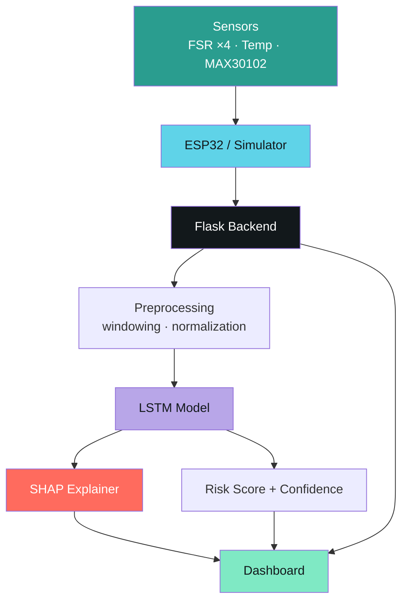
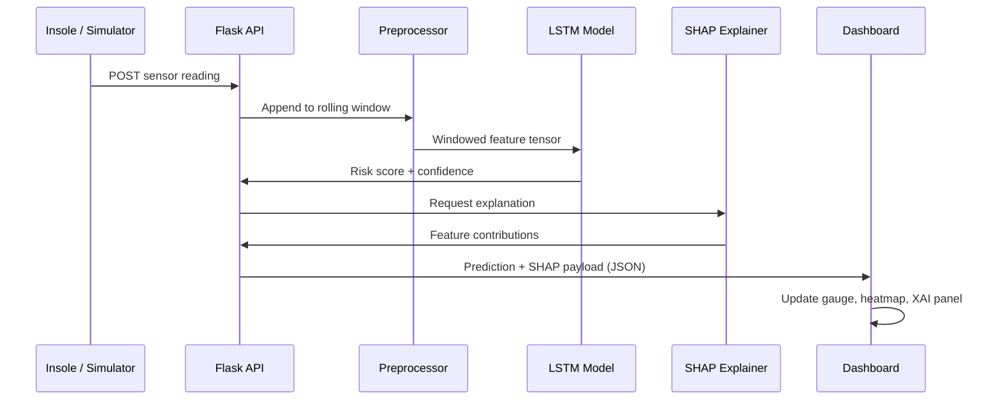

<div align="center">

# 🦶 Podos

### Smart Insole for Early Detection of Diabetic Foot Ulcer Risk
**using LSTM and Explainable AI**

<p>
An AI-powered smart insole system that monitors plantar pressure, temperature, heart rate,<br/>
and SpO₂ in diabetic patients — predicting ulcer risk in real time, with every prediction explained.
</p>

<p>
  
  
  
  
  
  
</p>

<p>
  <a href="#-features">Features</a> ·
  <a href="#-architecture">Architecture</a> ·
  <a href="#-installation">Installation</a> ·
  <a href="#-api-reference">API</a> ·
  <a href="#-model">Model</a> ·
  <a href="#-roadmap">Roadmap</a>
</p>

</div>

<br/>

<div align="center">

<p><i>Live cockpit view — sensor telemetry, DFU risk gauge, and explainability, in one screen.</i></p>
</div>

<br/>

## 📖 Overview

Diabetic foot ulcers (DFUs) are one of the leading causes of preventable amputation in diabetic patients — and they're detectable *before* they form, if the right signals are tracked continuously.

**Podos** is a full-stack, AI-driven monitoring system that:

- Streams plantar pressure, foot temperature, heart rate, and SpO₂ from a smart insole
- Feeds a rolling window of that data into a trained **LSTM** model to estimate real-time DFU risk
- Explains *why* the model made that prediction using **SHAP**, in plain clinical language
- Visualizes all of it on a live web dashboard — no black-box numbers, no unexplained alerts

The system currently runs on a **software simulator** in place of physical hardware. The architecture was deliberately built so the simulator can be swapped for a real **ESP32-based insole** with minimal code changes — see [Hardware](#-hardware).

<br/>

## ✨ Features

| | |
|---|---|
| 🔴 **Real-time Sensor Monitoring** | Live streaming of 4× FSR pressure points, temperature, heart rate, and SpO₂ |
| 🧠 **LSTM Risk Prediction** | Sequence model trained on rolling sensor windows to output a continuous DFU risk score |
| 🔍 **Explainable AI (SHAP)** | Every prediction ships with ranked positive/negative contributing features and a plain-language summary |
| ⚡ **Flask REST API** | Clean JSON endpoints for sensors, predictions, explanations, and history |
| 🖥️ **Premium Dashboard** | Live gauge, pressure heatmap, trend charts, and patient panel in a single-page UI |
| 📜 **Prediction History** | Timestamped log of every inference with risk level and explanation |
| 📈 **Trend Analysis** | Multi-metric time-series charts (pressure / temperature / vitals / risk) |
| 🧑‍⚕️ **Patient Management** | Structured patient profile — comorbidities, diabetes duration, neuropathy status |
| 🩺 **System Monitoring** | Model, backend, BLE, and battery health at a glance |
| 🔌 **Hardware-Ready Architecture** | Simulator and physical ESP32 insole share the same data contract |

<br/>

## 🏗️ Architecture



<details>
<summary><b>🔄 Live prediction sequence</b></summary>



</details>

<br/>

## 📁 Project Structure

```
podos/
├── app.py                     # Flask entry point
├── requirements.txt
├── models/
│   ├── lstm_dfu_model.h5      # Trained LSTM weights
│   └── scaler.pkl             # Feature scaler
├── backend/
│   ├── routes/
│   │   ├── sensors.py
│   │   ├── prediction.py
│   │   ├── shap_explainer.py
│   │   ├── history.py
│   │   └── patient.py
│   ├── inference/
│   │   ├── preprocess.py
│   │   └── predict.py
│   └── simulator/
│       └── insole_simulator.py
├── frontend/
│   ├── templates/
│   │   └── index.html
│   └── static/
│       ├── css/style.css
│       ├── js/script.js
│       ├── icons/
│       └── images/
├── hardware/
│   └── esp32_firmware/         # Planned — see Hardware section
├── notebooks/
│   ├── 01_feature_engineering.ipynb
│   └── 02_lstm_training.ipynb
└── docs/
    └── screenshots/
```

<br/>

## 🖼️ Screenshots

<div align="center">

| Dashboard | Prediction |
|---|---|
|  |  |

| Explainability | Trends |
|---|---|
|  |  |

| Patient File | System Status |
|---|---|
|  |  |

</div>

<br/>

## 🚀 Installation

```bash
# 1. Clone the repository
git clone https://github.com/<your-username>/podos.git
cd podos

# 2. Create and activate a virtual environment
python -m venv venv
source venv/bin/activate        # macOS / Linux
venv\Scripts\activate           # Windows

# 3. Install dependencies
pip install -r requirements.txt

# 4. Run the Flask server
python app.py
```

The dashboard will be available at `http://localhost:5000`.

<br/>

## 🧭 Usage

1. **Start the backend** — `python app.py` boots the Flask server and loads the trained LSTM model.
2. **Open the dashboard** — navigate to `http://localhost:5000` in your browser.
3. **Run the simulator** — the insole simulator starts emitting synthetic sensor readings automatically; toggle it via `GET /simulate`.
4. **Observe predictions** — the risk gauge updates live as each new sensor window is processed.
5. **View SHAP explanations** — the Explainability panel shows which features pushed the risk score up or down, in plain language.

<br/>

## 🔌 API Reference

| Method | Endpoint | Description |
|---|---|---|
| `GET` | `/` | Serves the dashboard |
| `GET` | `/simulate` | Starts / returns the simulated sensor feed |
| `POST` | `/predict` | Runs the LSTM on the latest sensor window, returns risk score + confidence |
| `GET` | `/history` | Returns the prediction log |
| `GET` | `/shap` | Returns SHAP feature contributions for the latest prediction |

<details>
<summary><b>Example response — <code>POST /predict</code></b></summary>

```json
{
  "score": 62,
  "confidence": 87,
  "level": "medium",
  "timestamp": "2026-07-26T09:41:00Z"
}
```

</details>

<br/>

## 🧠 Model

| Component | Detail |
|---|---|
| **Input features** | 4× FSR pressure, temperature, heart rate, SpO₂ |
| **Rolling window** | Sequence of *N* timesteps per inference (configurable) |
| **Architecture** | Stacked LSTM → Dense → Softmax/Sigmoid head |
| **Output classes** | `Low` · `Medium` · `High` risk |
| **Risk score** | Continuous 0–100 scale derived from model output |
| **Confidence** | Derived from prediction probability margin |

<br/>

## 🔍 Explainable AI

Every prediction is passed through a **SHAP** explainer wrapped around the trained LSTM, which decomposes the output into per-feature contributions:

- **Positive contributors** — features currently pushing the risk score *up* (e.g. sustained forefoot pressure, heel temperature asymmetry)
- **Negative contributors** — features currently pulling the risk score *down* (e.g. balanced gait timing, stable SpO₂)
- **Clinical summary** — a single human-readable sentence generated from the top contributing features, so the explanation reads like a clinician's note rather than a feature-importance dump

<br/>

## 🔧 Hardware

The system is currently powered by a software simulator that emits the exact data contract a physical insole would produce, so the swap requires **no backend or dashboard changes**.

**Planned hardware stack:**

| Component | Purpose |
|---|---|
| **ESP32** | Microcontroller — sensor acquisition + wireless transmission |
| **4× FSR sensors** | Plantar pressure at forefoot (×2) and heel (×2) |
| **Temperature sensor** | Localized foot temperature, asymmetry detection |
| **MAX30102** | Heart rate + SpO₂ |
| **BLE / Wi-Fi** | Wireless transmission to the Flask backend |

<br/>

## 🗺️ Roadmap

**Completed**
- [x] Dataset collection & cleaning
- [x] Feature engineering
- [x] LSTM model design
- [x] Model training & evaluation
- [x] Flask backend
- [x] Dashboard UI
- [x] SHAP explainability
- [x] REST API
- [x] Sensor simulator

**Remaining**
- [ ] ESP32 firmware
- [ ] Physical hardware integration
- [ ] Real sensor calibration
- [ ] Cloud deployment

<br/>

## 🔮 Future Improvements

- 📱 Mobile companion app
- ☁️ Cloud-hosted dashboard
- 🧑‍⚕️ Doctor portal with multi-patient view
- 🔐 Patient login & data isolation
- 🔔 Real-time alert notifications
- 👟 Personalized footwear recommendations
- ⚙️ Edge AI inference on-device (ESP32 / microcontroller)

<br/>

## 👤 Author

| | |
|---|---|
| **Name** | `<Jaiwanthini>` |
| **University** | `<Sahyadri College Of Engineering And Management>` |
| **Department** | `<CSE(AIML)>` |
| **Guide** | `<Dr.Gurusiddayya Hiremath>` |

<br/>

## 📄 License

Distributed under the **MIT License**. See [`LICENSE`](LICENSE) for details.

<br/>

<div align="center">

<sub>Built as a Final Year Engineering Project · Podos — because early signals should never be silent.</sub>

</div>
